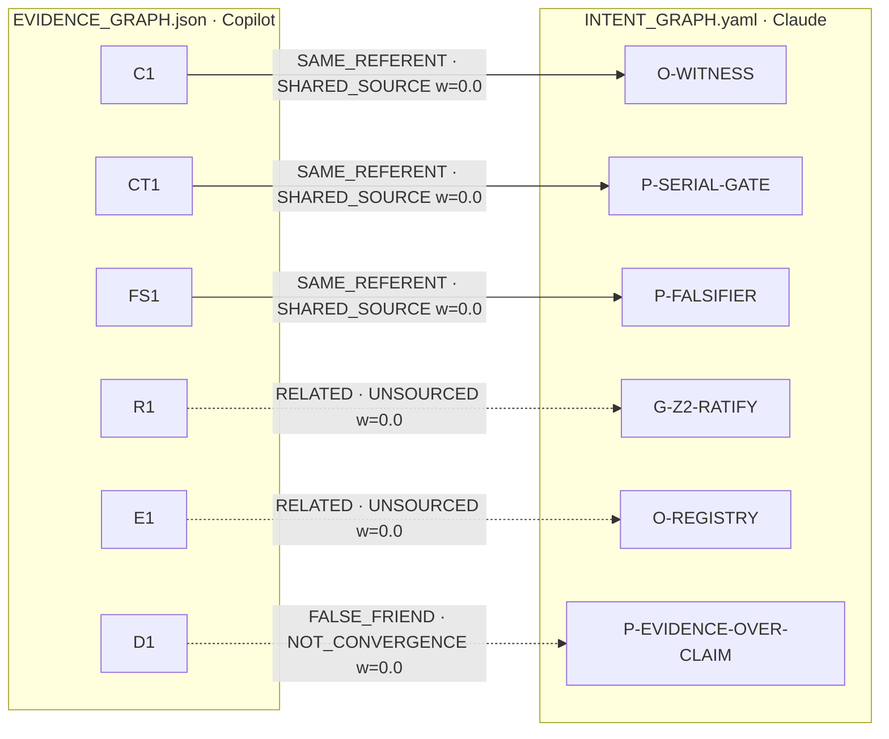

<!-- GENERATED by tools/graph_convergence_v1_0.py — do not edit by hand. -->
<!-- Source of truth: GRAPH_ALIGNMENT.yaml. Regenerate: python3 tools/graph_convergence_v1_0.py render -->

# GRAPH_CONVERGENCE — what two agent-authored graphs actually agree on

**Candidate:** Q-GRAPH-CONVERGENCE-01 · **Status:** PROPOSED

## Headline

- Aligned pairs: **6**
- Graded INDEPENDENT: **0**
- Total corroboration weight: **0.0**
- Declared divergences: **5**

> Every aligned pair scores zero. That is the result, not a failure of
> the method: the two agents read the same repository, so where they
> agree they are both transcribing one source. The comparison's whole
> signal is in the divergence table below.

## The graphs

| Graph | Author | Path | Authored | Access to the other | Grade |
|---|---|---|---|---|---|
| EVIDENCE | Copilot | `EVIDENCE_GRAPH.json` | 1 | INTENT | `UNAVAILABLE` |
| INTENT | Claude (Z1) | `INTENT_GRAPH.yaml` | 2 | EVIDENCE | `AVAILABLE_UNREAD_ASSERTED` |

## Convergence, graded

Weight is computed, never declared. A pair scores only when the two nodes
cite no source in common *and* the later author could not reach the earlier
graph. Anything else is transcription or inheritance.

| Intent | Evidence | Kind | Grade | Weight | Why |
|---|---|---|---|---|---|
| `O-WITNESS` | `C1` | SAME_REFERENT | **SHARED_SOURCE** | 0.0 | shared: CLAUDE.md, WITNESS_SERVICE_CONTRACT.md |
| `P-SERIAL-GATE` | `CT1` | SAME_REFERENT | **SHARED_SOURCE** | 0.0 | shared: CLAUDE.md (via declared lineage) |
| `P-FALSIFIER` | `FS1` | SAME_REFERENT | **SHARED_SOURCE** | 0.0 | shared: CLAUDE.md (via declared lineage) |
| `G-Z2-RATIFY` | `R1` | RELATED | **UNSOURCED** | 0.0 | evidence side declares no source; provenance unknown |
| `O-REGISTRY` | `E1` | RELATED | **UNSOURCED** | 0.0 | evidence side declares no source; provenance unknown |
| `P-EVIDENCE-OVER-CLAIM` | `D1` | FALSE_FRIEND | **NOT_CONVERGENCE** | 0.0 | declared FALSE_FRIEND |
| | | | **TOTAL** | **0.0** | |

## Divergence

Under shared sources, agreement is the expected outcome and carries no
information. Disagreement is the surprise, and it is the only part of this
comparison that survives the grading above.

### ONTOLOGY_DIVERGENCE · INTENT `node.status` vs EVIDENCE `edge.state`

INTENT grades maturity on the NODE ("this objective is CITED_NOT_IMPLEMENTED"). EVIDENCE grades it on the EDGE ("this artifact implements that claim, at state SPECIFIED"). The edge is the better locus and the reason is this session's own record: every Copilot finding across three review rounds was a statement about a source written without executing against the source — a defective edge between a node and its evidence, which a node-level status has no slot to express.

### COVERAGE_GAP · INTENT `conflicts_with (3 OPEN rows)` vs EVIDENCE `—`

EVIDENCE has no relation for "two artifacts in this tree disagree with each other". Its failure nodes record defects found in one artifact. The molt-window defect — MOLT_STATE.md resolving at window_end while TEMPORAL_DISSOLUTION_POLICY.md prohibits it — is invisible in that ontology, because neither file is wrong on its own terms.

### COVERAGE_GAP · INTENT `—` vs EVIDENCE `failure / defeats_if_unmitigated`

INTENT has no node type for an adversarial finding. AA-429-01 and AA-429-02 have nowhere to live in it, so a known authority-escalation surface would not appear on the intent graph at all.

### COVERAGE_GAP · INTENT `—` vs EVIDENCE `crosswalk_for (S1 -> R1)`

INTENT has no edge to an external standard. Every node resolves to a path inside this tree by E3, which is the anti-drift rule and also the reason the graph cannot say "this is our NIST AI RMF coverage".

### CONTRADICTION · INTENT `G-Z2-RATIFY` vs EVIDENCE `R1`

INTENT records G-Z2-RATIFY as a gate. EVIDENCE's R1 gates D1 at state SPECIFIED — specified, not TESTED, not OBSERVED. The tree agrees with EVIDENCE: .z1-control/ratify.py --verify runs continue-on-error: true in that workflow, and anti-cascade is not evaluated there. An earlier version of the INTENT node claimed the workflow "refuses a merge without a Z2 hash" and was corrected. Where the two graphs contradicted each other, the one grading the edge rather than the node was right.

## Relation vocabularies

| Intent rel | Evidence rel | Kind | Note |
|---|---|---|---|
| `grounds` | `constrained_by` | PARTIAL | Both say "this holds because of that". `grounds` points from the ground to the grounded; `constrained_by` points the other way. Direction is reversed, so a tool that matched on name alone would read every such pair backwards. |
| `measures` | `verifies` | PARTIAL | `measures` produces a number; `verifies` produces a pass/fail. A gate that verifies does not necessarily measure, and W2 (an objective with no inbound `measures`) would not fire for a verified-only objective. |
| `enforces` | `gates` | SAME | Both name a refusal surface standing between a change and the tree. |
| `realizes` | `implements` | PARTIAL | `realizes` runs objective -> mission -> vision, an intent ladder. `implements` runs artifact -> claim, an evidence ladder. They meet only where an objective is also an artifact. |
| `conflicts_with` | `defeats_if_unmitigated` | PARTIAL | The nearest thing to a real convergence in the two vocabularies, and the difference is the interesting part. `conflicts_with` is symmetric in force and open until a Z2 decision closes it. `defeats_if_unmitigated` is directional and closes on mitigation, not on ratification. Adopting it wholesale would let an engineer close a governance conflict by patching. |

## Canvas

## Warnings

- W2: EVIDENCE coverage 6/15 nodes compared; uncompared: A1, A2, C2, CT2, T1, T2 (+3 more)
- W2: INTENT coverage 6/29 nodes compared; uncompared: V-HAIOS, M-OBSERVABILITY, M-GOVERNED-CHANGE, M-RESOURCE-TRUTH, P-ADMISSION, P-NON-COMMENSURABLE (+17 more)
- W3: total corroboration weight is 0.0 — this comparison found no independent agreement. Every aligned pair shares a source, has unrecorded provenance, was read, or is a declared false friend.

## Backfill

Backfilling is permitted (`permitted: True`) and forced to
`BACKFILL_UNGRADED` at weight 0.0. A backfilled row counts for
coverage and never for corroboration: its author has already seen how the
artifact turned out, which makes them a reader of the answer, not a witness.

