<!-- GENERATED FILE — do not hand-edit.
     Source: INTENT_GRAPH.yaml · Renderer: tools/intent_graph_v1_0.py
     Regenerate: python3 tools/intent_graph_v1_0.py render -->

# INTENT_GRAPH.md — how vision, mission, principles and objectives interact

**Candidate:** Q-INTENT-GRAPH-01  
**Status:** PROPOSED — not effective until Z2 ratification hash  
**Source of truth:** `INTENT_GRAPH.yaml` (edit there; this file is rendered)  
**Temporal class:** OBSERVATIONAL · scheduling authority: false

This page is a projection. It states nothing that is not in the graph, and the
graph states nothing whose source does not resolve in the tree.

---

## The canvas

Read it upward: instruments measure objectives, principles ground them, objectives
realize missions, missions realize the vision. A crossed edge (`x--x`) is a live
contradiction, labelled with the candidate open against it.

```mermaid
flowchart BT
  subgraph VISION[vision]
    V-HAIOS(["V-HAIOS<br/>Self-sufficient human-AI orchestration"])
  end
  subgraph MISSION[mission]
    M-OBSERVABILITY["M-OBSERVABILITY<br/>Behavioral observability"]
    M-GOVERNED-CHANGE["M-GOVERNED-CHANGE<br/>Governed recursive change"]
    M-RESOURCE-TRUTH["M-RESOURCE-TRUTH<br/>Resource-based operation"]
  end
  subgraph PRINCIPLE[principle]
    P-FALSIFIER{{"P-FALSIFIER<br/>Falsifier doctrine"}}
    P-ADMISSION{{"P-ADMISSION<br/>Admission precedes correction"}}
    P-EVIDENCE-OVER-CLAIM{{"P-EVIDENCE-OVER-CLAIM<br/>Claim reconciles to tree"}}
    P-NON-COMMENSURABLE{{"P-NON-COMMENSURABLE<br/>Non-commensurable units"}}
    P-TEMPORAL-PURITY{{"P-TEMPORAL-PURITY<br/>Clocks measure, they do not authorize"}}
    P-SERIAL-GATE{{"P-SERIAL-GATE<br/>Serial ratification"}}
  end
  subgraph OBJECTIVE[objective]
    O-MOLT-CYCLE["O-MOLT-CYCLE<br/>Molt lifecycle"]
    O-REGISTRY["O-REGISTRY<br/>Findings registry"]
    O-QUEUE["O-QUEUE<br/>Work admission"]
    O-TEMPORAL-GATE["O-TEMPORAL-GATE<br/>Temporal dissolution"]
    O-WITNESS["O-WITNESS<br/>Witness ledger"]
    O-DECISION-ROUTING["O-DECISION-ROUTING<br/>Z1 to Z2 decision routing"]
    O-DOC-CONTROL["O-DOC-CONTROL<br/>Document control"]
    O-INTENT-GRAPH["O-INTENT-GRAPH<br/>Shared intent substrate"]
  end
  subgraph GATE[gate]
    G-Z2-RATIFY[/"G-Z2-RATIFY<br/>Z2 ratification gate"/]
    G-TEMPORAL-SCAN[/"G-TEMPORAL-SCAN<br/>Temporal control scan"/]
    G-ANTI-CASCADE[/"G-ANTI-CASCADE<br/>Anti-cascade bounds"/]
    G-FALSIFIER-LINT[/"G-FALSIFIER-LINT<br/>Falsifier lint"/]
  end
  subgraph INSTRUMENT[instrument]
    I-NF-LEDGER[("I-NF-LEDGER<br/>NF ledger")]
    I-RESOURCE-CENSUS[("I-RESOURCE-CENSUS<br/>Resource census")]
    I-QUEUE-ENGINE[("I-QUEUE-ENGINE<br/>Priority queue engine")]
    I-INTENT-GRAPH[("I-INTENT-GRAPH<br/>Intent graph renderer")]
  end

  M-OBSERVABILITY -->|realizes| V-HAIOS
  M-GOVERNED-CHANGE -->|realizes| V-HAIOS
  M-RESOURCE-TRUTH -->|realizes| V-HAIOS
  O-MOLT-CYCLE -->|realizes| M-GOVERNED-CHANGE
  O-REGISTRY -->|realizes| M-GOVERNED-CHANGE
  O-WITNESS -->|realizes| M-GOVERNED-CHANGE
  O-INTENT-GRAPH -->|realizes| M-GOVERNED-CHANGE
  O-DOC-CONTROL -->|realizes| M-GOVERNED-CHANGE
  O-DECISION-ROUTING -->|realizes| M-GOVERNED-CHANGE
  O-QUEUE -->|realizes| M-RESOURCE-TRUTH
  O-TEMPORAL-GATE -->|realizes| M-RESOURCE-TRUTH
  P-FALSIFIER -.->|grounds| O-MOLT-CYCLE
  P-FALSIFIER -.->|grounds| O-REGISTRY
  P-SERIAL-GATE -.->|grounds| O-MOLT-CYCLE
  P-SERIAL-GATE -.->|grounds| O-REGISTRY
  P-SERIAL-GATE -.->|grounds| O-WITNESS
  P-SERIAL-GATE -.->|grounds| O-DECISION-ROUTING
  P-TEMPORAL-PURITY -.->|grounds| O-DECISION-ROUTING
  P-ADMISSION -.->|grounds| O-REGISTRY
  P-ADMISSION -.->|grounds| O-INTENT-GRAPH
  P-EVIDENCE-OVER-CLAIM -.->|grounds| O-REGISTRY
  P-EVIDENCE-OVER-CLAIM -.->|grounds| O-INTENT-GRAPH
  P-EVIDENCE-OVER-CLAIM -.->|grounds| O-DOC-CONTROL
  P-NON-COMMENSURABLE -.->|grounds| O-QUEUE
  P-TEMPORAL-PURITY -.->|grounds| O-QUEUE
  P-TEMPORAL-PURITY -.->|grounds| O-TEMPORAL-GATE
  P-TEMPORAL-PURITY -.->|grounds| O-MOLT-CYCLE
  P-SERIAL-GATE -.->|grounds| G-Z2-RATIFY
  P-FALSIFIER -.->|grounds| G-FALSIFIER-LINT
  P-TEMPORAL-PURITY -.->|grounds| G-TEMPORAL-SCAN
  P-ADMISSION -.->|grounds| G-ANTI-CASCADE
  G-Z2-RATIFY -.->|enforces| P-SERIAL-GATE
  G-Z2-RATIFY -.->|enforces| P-FALSIFIER
  G-TEMPORAL-SCAN -.->|enforces| P-TEMPORAL-PURITY
  G-FALSIFIER-LINT -.->|enforces| P-FALSIFIER
  G-ANTI-CASCADE -.->|enforces| P-ADMISSION
  I-NF-LEDGER ==>|measures| O-MOLT-CYCLE
  I-NF-LEDGER ==>|measures| O-REGISTRY
  I-RESOURCE-CENSUS ==>|measures| O-QUEUE
  I-QUEUE-ENGINE ==>|measures| O-QUEUE
  I-INTENT-GRAPH ==>|measures| O-INTENT-GRAPH
  G-ANTI-CASCADE -.->|constrains| O-MOLT-CYCLE
  G-TEMPORAL-SCAN -.->|constrains| O-DOC-CONTROL
  O-MOLT-CYCLE x--x|conflicts: Q-MOLT-TEMPORAL-PURITY-01| O-TEMPORAL-GATE
  O-DOC-CONTROL x--x|conflicts: Q-TEMPORAL-DISSOLUTION-01| O-TEMPORAL-GATE
  O-DECISION-ROUTING x--x|conflicts: Q-MOLT-TEMPORAL-PURITY-01| O-TEMPORAL-GATE

  classDef conflicted stroke-dasharray: 4 3,stroke-width:2px
  class O-DECISION-ROUTING,O-DOC-CONTROL,O-MOLT-CYCLE conflicted
```

---

## Open contradictions

Each row is two live artifacts that cannot both be right. `q_ref` names the
candidate that would settle it — an open row with no candidate fails validation.

| Between | And | Candidate | What contradicts |
|:--|:--|:--|:--|
| `O-MOLT-CYCLE` | `O-TEMPORAL-GATE` | Q-MOLT-TEMPORAL-PURITY-01 | MOLT_STATE.md resolves a molt at `window_end` and computes brier_actual "at window close" — a molt outcome determined by elapsed time. TEMPORAL_DISSOLUTION_POLICY.md classifies exactly that as INVALID_INTERNAL_DEADLINE, and BOOT_PROCESS_MAP.md already published the successor reading ("Molt completes when measurement criteria met") without MOLT_STATE.md being migrated to match. |
| `O-DOC-CONTROL` | `O-TEMPORAL-GATE` | Q-TEMPORAL-DISSOLUTION-01 | document-registry.yaml derives review_due from review_interval_days and renders documents "visibly overdue" once the interval elapses. Obligation is created by the calendar rather than by source drift. |
| `O-DECISION-ROUTING` | `O-TEMPORAL-GATE` | Q-MOLT-TEMPORAL-PURITY-01 | z1-inbox/INDEX.yaml carries `decision_window_days: 2` and CLAUDE.md states a 48h Z2 decision window with contest rights expiring on elapsed time. The ratifier's attention is a measured resource (RAT-min); a two-day clock neither creates it nor licenses escalation when it runs out. |

**O-MOLT-CYCLE ↔ O-TEMPORAL-GATE — evidence**

- MOLT_STATE.md: window_start / window_end / prediction.window_days
- BOOT_PROCESS_MAP.md: "Molt window_end at timestamp" listed as REMOVED
- TEMPORAL_DISSOLUTION_POLICY.md: INTERNAL_WORK_DEADLINE class

**O-DOC-CONTROL ↔ O-TEMPORAL-GATE — evidence**

- document-registry.yaml: review_interval_days, review_due, overdue
- TEMPORAL_CONTROL_AUDIT.md: document-control finding

**O-DECISION-ROUTING ↔ O-TEMPORAL-GATE — evidence**

- z1-inbox/INDEX.yaml: decision_window_days: 2
- CLAUDE.md: "Decision window: 48h for routine decisions"
- BOOT_PROCESS_MAP.md: "Z2 responds within 48h" listed as REMOVED

---

## Layers

### Vision

| Id | Name | Statement | Source | State |
|:--|:--|:--|:--|:--|
| `V-HAIOS` | Self-sufficient human-AI orchestration | A human-AI orchestration system demonstrating human-generated agency, independent growth, and mutual harmonization between technical systems and human operators — operating as behavioral observability infrastructure rather than as a product. | `OPS_ROADMAP_V1.2.md` · 1. Vision & Objective | live |

### Mission

| Id | Name | Statement | Source | State |
|:--|:--|:--|:--|:--|
| `M-OBSERVABILITY` | Behavioral observability | Measure the gap between what an AI system claims about its own behavior and what it does when that claim is tested. The gap is the finding; it requires no claim about consciousness or intent to be meaningful. | `SEED.md` · 1. What HumanAIOS Is | live |
| `M-GOVERNED-CHANGE` | Governed recursive change | Every change to a constant, gate or authority passes a serial ratifier, carries a prediction and a falsifier, and is measured after application — so that the system can correct itself without cascading. | `CLAUDE.md` · Decision Routing | live |
| `M-RESOURCE-TRUTH` | Resource-based operation | Schedule work by measured resource state and readiness predicates, in non-commensurable natural units, with no numeraire and no clock authority. | `docs/RESOURCE_BASED_ECONOMICS.md` | live |

### Principle

| Id | Name | Statement | Source | State |
|:--|:--|:--|:--|:--|
| `P-FALSIFIER` | Falsifier doctrine | No hypothesis, molt or candidate enters the registry without a specific observable condition that would prove it wrong. | `CLAUDE.md` · Decision Routing | live |
| `P-ADMISSION` | Admission precedes correction | A system that cannot admit its own malfunction cannot correct it. Sequence is load-bearing — admission, inventory, disclosure, amends. | `PRINCIPLES_SEED_V1_0.md` · 1.A | live |
| `P-EVIDENCE-OVER-CLAIM` | Claim reconciles to tree | Every statement made in a session is walked back against the tree at close. A claim with no matching artifact is a RECEIPT-GAP, not a result. | `CLAUDE.md` · B.6 | live |
| `P-NON-COMMENSURABLE` | Non-commensurable units | Resource cost is a vector of registered natural units. No scalar effort unit, no numeraire, no cross-dimension conversion. | `RESOURCE_UNITS.yaml` | live |
| `P-TEMPORAL-PURITY` | Clocks measure, they do not authorize | No internal work becomes urgent, expired, escalated, reordered or replenished because elapsed time passed. Readiness is authority ∧ dependencies ∧ resources ∧ evidence ∧ safety. | `TEMPORAL_DISSOLUTION_POLICY.md` · Invariant | live |
| `P-SERIAL-GATE` | Serial ratification | One ratifier signs. Proposal, ratification and execution are separate roles and no role may collapse into another. | `CLAUDE.md` · Authority Roles | live |

### Objective

| Id | Name | Statement | Source | State |
|:--|:--|:--|:--|:--|
| `O-MOLT-CYCLE` | Molt lifecycle | Ratified constant changes move PROPOSED → RATIFIED → APPLIED → MEASURED → KEPT\|REVERTED under anti-cascade bounds. | `MOLT_STATE.md` | conflicted |
| `O-REGISTRY` | Findings registry | Append-only record of findings, integrity corrections and hypotheses. | `REGISTERED.md` | live |
| `O-QUEUE` | Work admission | Rank eligible work by impact and by yield per binding-constraint unit. No term in the score is derived from waiting. | `PRIORITY_QUEUE.md` | live |
| `O-TEMPORAL-GATE` | Temporal dissolution | Remove hidden calendar authority from every active control surface; classify every remaining clock. | `TEMPORAL_DISSOLUTION_POLICY.md` | live |
| `O-WITNESS` | Witness ledger | Human-machine decision attribution, so Z3 executors can be onboarded without collapsing authority. | `WITNESS_SERVICE_CONTRACT.md` | proposed |
| `O-DECISION-ROUTING` | Z1 to Z2 decision routing | Candidate blocks reach the ratifier, carry a status the ratifier can act on, and record the decision against the block. | `z1-inbox/INDEX.yaml` | conflicted |
| `O-DOC-CONTROL` | Document control | Controlled documents carry an owner, a review state and a provenance record. | `document-registry.yaml` | conflicted |
| `O-INTENT-GRAPH` | Shared intent substrate | Hold vision, mission, principles and objectives as a typed graph so that grounding, measurement and contradiction are machine-checkable rather than re-derived by reading. | `INTENT_GRAPH.yaml` | proposed |

### Gate

| Id | Name | Statement | Source | State |
|:--|:--|:--|:--|:--|
| `G-Z2-RATIFY` | Z2 ratification gate | Refuses a merge without a Z2 hash, a falsifier, and anti-cascade compliance. | `.github/workflows/z2_ratification_gate.yml` | live |
| `G-TEMPORAL-SCAN` | Temporal control scan | Refuses added lines on active control surfaces that create internal deadlines without a permitted temporal classification. | `tests/test_temporal_dissolution_gate.py` | live |
| `G-ANTI-CASCADE` | Anti-cascade bounds | One open molt per constant, K=3 system-wide, freeze after two consecutive reverts. | `molt_cycle.py` | live |
| `G-FALSIFIER-LINT` | Falsifier lint | Named in CLAUDE.md and in z2_ratification_gate.yml as the check that refuses a hypothesis without a falsifier. No workflow implementing it was found under .github/workflows/. | `CLAUDE.md` · CI/CD Gates | cited, not implemented |

### Instrument

| Id | Name | Statement | Source | State |
|:--|:--|:--|:--|:--|
| `I-NF-LEDGER` | NF ledger | Append-only hash-chained record of predictions and resolved outcomes. | `ledgers/NF_LEDGER.jsonl` | live |
| `I-RESOURCE-CENSUS` | Resource census | Measures obligations, stocks and waste against the binding constraint. | `tools/resource_census_v0_1.py` | live |
| `I-QUEUE-ENGINE` | Priority queue engine | Two-band constraint allocation over eligible work. | `priority_queue_engine.py` | live |
| `I-INTENT-GRAPH` | Intent graph renderer | Validates this file against the tree and renders INTENT_GRAPH.md. Reports orphans, unresolved sources and open conflicts. | `tools/intent_graph_v1_0.py` | proposed |

---

## Grounding crosswalk

For each principle: what it grounds, and what mechanically enforces it. A principle
with no enforcing gate is honoured by convention, which is a thing worth seeing.

| Principle | Grounds | Enforced by |
|:--|:--|:--|
| `P-FALSIFIER` Falsifier doctrine | `O-MOLT-CYCLE`, `O-REGISTRY`, `G-FALSIFIER-LINT` | `G-Z2-RATIFY`, `G-FALSIFIER-LINT` ⚠️ |
| `P-ADMISSION` Admission precedes correction | `O-REGISTRY`, `O-INTENT-GRAPH`, `G-ANTI-CASCADE` | `G-ANTI-CASCADE` |
| `P-EVIDENCE-OVER-CLAIM` Claim reconciles to tree | `O-REGISTRY`, `O-INTENT-GRAPH`, `O-DOC-CONTROL` | — convention only |
| `P-NON-COMMENSURABLE` Non-commensurable units | `O-QUEUE` | — convention only |
| `P-TEMPORAL-PURITY` Clocks measure, they do not authorize | `O-DECISION-ROUTING`, `O-QUEUE`, `O-TEMPORAL-GATE`, `O-MOLT-CYCLE`, `G-TEMPORAL-SCAN` | `G-TEMPORAL-SCAN` |
| `P-SERIAL-GATE` Serial ratification | `O-MOLT-CYCLE`, `O-REGISTRY`, `O-WITNESS`, `O-DECISION-ROUTING`, `G-Z2-RATIFY` | `G-Z2-RATIFY` |

---

## Validator report

Produced by `python3 tools/intent_graph_v1_0.py check`.

No errors: every node resolves to a path in the tree, every objective reaches
the vision, every objective and gate is grounded, and every open contradiction
names a candidate.

**6 warning(s)** — reported, not blocking:

- W1 G-FALSIFIER-LINT: cited by CLAUDE.md with no implementation found
- W2 O-TEMPORAL-GATE: no instrument measures this objective
- W2 O-WITNESS: no instrument measures this objective
- W2 O-DECISION-ROUTING: no instrument measures this objective
- W2 O-DOC-CONTROL: no instrument measures this objective
- W3 M-OBSERVABILITY: no objective in this repository realizes this mission

---

## How to use this with the other side

- **Night (Z2)** edits meaning in `INTENT_GRAPH.yaml`: node statements, `status`,
  and the resolution of a `conflicts_with` row. Those are decisions.
- **Claude (Z1)** edits structure: proposes edges, keeps `source` honest, files a
  new `conflicts_with` row the moment it reads two artifacts that disagree, and
  regenerates this page.
- **Neither** hand-edits this file.

The exchange that previously needed a session — *does this still ground out in
anything we said we believed?* — is `trace <node-id>`.
