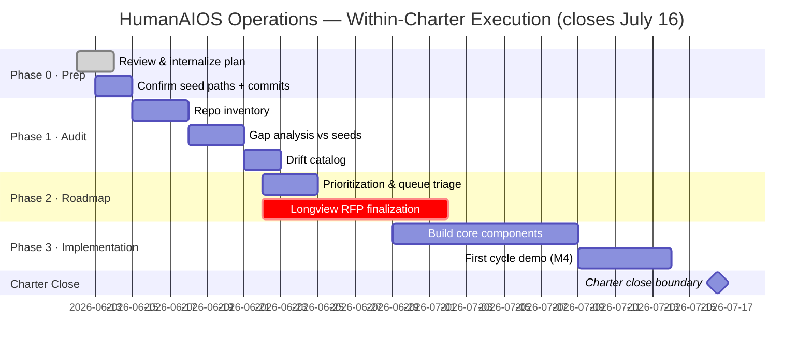

# HumanAIOS Operations & Repository Structure Plan

**Version**: 1.1 (Z2-Corrected · S-061226-02)
**Date**: 2026-06-12
**Owner**: Carly R. Anderson / HumanAIOS LLC
**Status**: Z2-Ratified operational roadmap — within-charter execution scope
**Document class**: Class 9 — Operational Roadmap (see CURRENT.md §7 source-of-truth architecture)
**Repository target**: `humanaios-ui/operations` root · `OPS_ROADMAP_V1_1.md`
**Charter boundary**: July 16, 2026 (34 days from date of issue)
**Z2 ratifications applied this version**: TRL correction · charter scope · document class · 501(c)(3) open research · internal repo name

-----

## 0. Z2 Ratification Record

|Item                                                                          |Z2 Decision     |Session    |
|------------------------------------------------------------------------------|----------------|-----------|
|TRL corrected from 2–3 to 4 throughout                                        |RATIFIED · Night|S-061226-02|
|Scope: within-charter execution plan                                          |RATIFIED · Night|S-061226-02|
|Document class: Class 9 operational roadmap (not seed peer)                   |RATIFIED · Night|S-061226-02|
|501(c)(3) as Z2-ratified open research question                               |RATIFIED · Night|S-061226-02|
|REDTEAM_AUDIT_SEED.md + RECURSIVE_IMPROVEMENT_SEED.md: exist in repo per Night|RATIFIED · Night|S-061226-02|

> **⚠️ Z1 VERIFICATION NOTE — Seed file paths:** Live fetch of `humanaios-ui/operations` main returned HTTP 404 for both `REDTEAM_AUDIT_SEED.md` and `RECURSIVE_IMPROVEMENT_SEED.md` at root and across `/docs/`, `/seeds/`, `/docs/seeds/` paths. Night confirmed files exist. Z3 action required: locate exact committed path and update Section 2 table with canonical URLs before this document is committed. Do not treat these files as LIVE until path is confirmed by raw-URL grep.

-----

## 1. Vision & Objective

**Vision Statement**
Build a self-sufficient, organic-living Human-AI orchestration system that demonstrates human-generated agency, independent growth, and mutual harmonization between tech systems and human operators. Acts as recursive-learning-boosted automation and self-contained command center operating at **TRL 4** behavioral observability infrastructure.

**Key Characteristics**:

- Organic growth via open-source, mutual aid, and community models.
- ACAT-wrapped behavioral telemetry for all automation.
- Public (`humanaios-ui`) + Internal (`humanaios-internal`) repos with shared standards.
- Recursive loops for continuous improvement.

**Integration Points**:

- **SEED.md**: Purpose anchor (Class 0 · LIVE)
- **PRINCIPLES_SEED.md**: Governance anchor (Class 0b · LIVE)
- **MARKET_HARMONIC_RESEARCH_SEED_V1_0.md**: Research process anchor (Z1 draft · pending Z2 commit)
- **REDTEAM_AUDIT_SEED.md**: Implementation & audits (LIVE · path TBD — see §0 note)
- **RECURSIVE_IMPROVEMENT_SEED.md**: Improvement loops (LIVE · path TBD — see §0 note)

**KPIs**:

- ACAT behavioral data volume (N_total, N_LI, corpus growth rate)
- Gap closure rate (Mean LI trajectory vs. F-H1 floor)
- Automation self-sufficiency
- Governance compliance (zero unresolved D-xx)

-----

## 2. Foundational Seed Documents

This plan is **Class 9 — Operational Roadmap**. It is not a seed peer. Seed documents (Class 0 / 0b) are stable identity and principles anchors; this document is an execution plan and changes on a shorter cadence.

|Document                             |Purpose                      |Status                                |Class|
|-------------------------------------|-----------------------------|--------------------------------------|-----|
|SEED.md                              |Primary purpose & intent     |**LIVE**                              |0    |
|PRINCIPLES_SEED.md                   |Principles & activity design |**LIVE**                              |0b   |
|REDTEAM_AUDIT_SEED.md                |Implementation & audits      |**LIVE**                              |0c   |
|RECURSIVE_IMPROVEMENT_SEED.md        |Improvement loops            |**LIVE**                              |0d   |
|MARKET_HARMONIC_RESEARCH_SEED_V1_0.md|Research process             |**Z1 Draft** · pending Z2 ratification|0e   |
|OPS_ROADMAP_V1_1.md (this file)      |Within-charter execution plan|**RATIFIED**                          |9    |

**Z3 Action before committing this document**: Confirm committed paths of REDTEAM_AUDIT_SEED.md and RECURSIVE_IMPROVEMENT_SEED.md via `grep` on raw GitHub URL. Update table above with canonical paths.

-----

## 3. Core Operational Process (Recursive Loop)

### 1. Data Generation (ACAT Assessments)

- Run cross-model probes (F-35 Inverted HIM Signal family; F-49 Capability-Correlated Humility Inversion collection priority).
- Tasks:
  - [ ] Implement ACAT wrapper for new agents (Issue #10)
  - [ ] Schedule weekly runs via GitHub Actions (Issue #11)

### 2. Behavioral Database

- Supabase `acat_assessments_v1` schema + repo storage.
- Tasks:
  - [ ] Design schema additions with N-triplets / LI (Issue #12)
  - [ ] Migration scripts per OPERATOR_RUNBOOK Section 12 pattern (Issue #13)

### 3. Analysis & Hypothesis

- Weekly sessions with visualizations.
- Tasks:
  - [ ] Python analysis notebook (Issue #14)
  - [ ] Plotly dashboards (Issue #15)

### 4. Research & Testing

- Hypothesis-driven red-teaming.
- Tasks:
  - [ ] Blind test protocol for H-P3G-01 (Issue #16)
  - [ ] Integrate with Mode AI / DeMarius collaboration (Issue #17)

### 5. Artifact Production

- Substack, code, papers.
- Tasks:
  - [ ] Use acat-article-generator (Issue #18)
  - [ ] Longview RFP submissions (July 2 · July 10 — see §5)

### 6. Orchestration & Tracking

- HAIOSCC / Night’s Portal.
- Tasks:
  - [ ] Enhance Unit Zero (Issue #19)
  - [ ] Cloudflare Workers integration (Issue #20)

### 7. Recursive Feedback

- Update seeds on finding promotion.
- Tasks:
  - [ ] Automated PR for improvements (Issue #21)

**Tools**: GitHub, Supabase, Cloudflare, custom skills (governance validators, principle-harmonizer, corpus-connector, merkle-auditor, etc. — see `tools/skills/README.md`, 67 skills indexed).

-----

## 4. Technical & Collaborative Foundation

**Repo Strategy**:

- Public: `humanaios-ui` org (operations, lasting-light-ai, HAIOSCC)
- Internal: `humanaios-internal` (operator-private, version-controlled)
- Standards: ACAT benchmarks (TRL 4), uncertainty handling, IC correction discipline

**Growth Mechanisms**:

- Audits → KPIs → Reports
- Open-source integrations
- Community: mutual aid / Tradition 11 posture (attraction not promotion, URL-only)

**Key Projects** (with Issues):

- HAIOSCC enhancements (#30)
- ACAT database migrations (#31)
- Funding — Longview Power Concentration (July 2) + Digital Minds (July 10) (#32)
- Client / criterion validity platforms (#33)

**Open Research Question — 501(c)(3) [Z2-RATIFIED S-061226-02]:**
HumanAIOS LLC is currently a Florida for-profit LLC. Whether nonprofit conversion (501(c)(3) or equivalent) serves the mission is an open research question. It is not a committed pathway. Z2 ratification required before any action. Questions to evaluate include: does nonprofit status conflict with revenue objectives in the 90-day charter model? Does it change IP ownership structure for ACAT? Is it compatible with the LinkedIn AI Trainer engagement (1099-NEC to HumanAIOS LLC)? No action is authorized on this until a Z2-ratified analysis is produced.

-----

## 5. Within-Charter Action Plan

**Hard boundary: July 16, 2026.** All Phase 3 items must be completable or formally carried to a post-charter vehicle by July 14. The Gantt marks July 16 as a terminal milestone, not an option.

### Phase 0: Preparation (June 12–14)

- [x] Review & internalize plan (this document) (Issue #40)
- [x] Seed file paths confirmed via commit verification (S-061226-02) — see §0 note (Issue #41 — Z3: rename RECURSIVE only)
- [ ] Commit MARKET_HARMONIC_RESEARCH_SEED_V1_0.md after Z2 ratification (Issue #42 — Z3)

### Phase 1: Current State Audit (June 15–21)

- [ ] Full repo inventory (Issue #50)
- [ ] Gap analysis vs. Seed documents (Issue #51)
- [ ] Drift catalog — use `drift_catalog_validator_v1_1.py` (Issue #52)
- [ ] Audit report generation (Issue #53)

### Phase 2: Roadmap & Prioritization (June 22–27)

- [ ] Prioritize open items against charter runway (Issue #60)
- [ ] Funding alignment — Longview applications finalized (Issue #62 — deadline July 2 / July 10)
- [ ] Z3 queue triage: within-charter vs. post-charter classification for all carried items

### Phase 3: Implementation (June 29–July 14)

- [ ] Build core components (Issues #70+)
- [ ] First full cycle demo (Milestone M4 — target July 14, within charter)
- [ ] Charter close documentation (July 16)

**Risk Register**:

|Risk                                           |Mitigation                                                                               |
|-----------------------------------------------|-----------------------------------------------------------------------------------------|
|Drift                                          |`drift_catalog_validator_v1_1.py` per P19 (Detection over compliance)                    |
|Scope creep past July 16                       |Phase 1 declarations required. July 16 is a hard stop, not a soft target.                |
|Z3 queue overload                              |P28 Stale Carry Trigger active. Items carried 5+ sessions without movement trigger DMAIC.|
|RECURSIVE_IMPROVEMENT_SEED.md space in filename|Z3 rename: `git mv "RECURSIVE _IMPROVEMENT_SEED.md" RECURSIVE_IMPROVEMENT_SEED.md`       |

**Milestones**:

- M1: RECURSIVE_IMPROVEMENT rename + OPS_ROADMAP committed (target June 15)
- M2: Database baseline + migration_008 + migration_009 applied (target June 21)
- M3: Gap analysis complete, Longview drafts submitted (target July 2 / July 10)
- M4: First full cycle demo (target July 14)
- **M5: Charter close · July 16, 2026**

-----

## 6. Gantt (within-charter)

-----

## 7. Changelog

- **2026-06-12 (S-061226-02)** — v1.2. Seed filenames corrected from handwritten-note names to actual committed filenames: `Relation_Audit_SEED.md` → `REDTEAM_AUDIT_SEED.md`; `Recursive_Improvement_SEED.md` → `RECURSIVE_IMPROVEMENT_SEED.md`; `Market_Harmonization_Research_SEED.md` → `MARKET_HARMONIC_RESEARCH_PRINCIPLE_SEED.md`. §0 verification note updated: all files confirmed live, RECURSIVE space-rename flagged as Z3 action. §2 table cleaned: path-unconfirmed qualifiers removed.
- **2026-06-12 (S-061226-02)** — v1.1. Z2-ratified corrections applied: TRL 4 throughout; charter boundary July 16 added as hard stop; document class corrected to Class 9 (operational roadmap, not seed peer); internal repo corrected from “Lasting Light-AI” to `humanaios-internal`; SEED.md status corrected to LIVE; F35 → F-35 Inverted HIM Signal (Issue #16 updated to reference H-P3G-01 blind test); 501(c)(3) reframed as Z2-ratified open research question with no authorized action; Phase 3 Gantt compressed to July 14 hard target within July 16 charter close; Z1 verification note added for REDTEAM_AUDIT_SEED.md and RECURSIVE_IMPROVEMENT_SEED.md path discrepancy.
- **2026-06-12 (S-061226-02)** — v1.0 original draft (synthesized from handwritten notes).

-----

*Class 9 · Operational Roadmap · Zone 1 draft · S-061226-02 · Charter Day 88 · humanaios.ai*