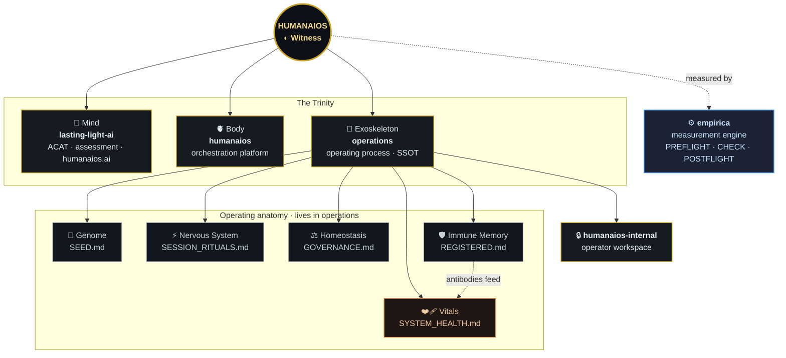

  

<h1 align="center">START HERE</h1>

<em>The Witness — an observable, autonomous human + AI collaboration framework.</em>

<b>You are in 🦴 <b>operations</b> — the exoskeleton & single source of truth.</b>

---

> **New here?** This page is the front door to the whole system. The map below is **live and clickable** — every node links to the repo or document it names. Start at the center and follow the branch you need.

## 🗺️ The system, at a glance

💡 Node links open on GitHub's rendered view. On mobile or in plain viewers, use the tables below.

## 🚪 Three doors

| If you want to… | Go to |
|---|---|
| **See the story** (what this is, from outside) | 🌍 **[humanaios.ai](https://humanaios.ai)** — the public site (about · research · observatory) |
| **Understand how it operates** (governance, rituals, findings) | 🦴 **[operations](https://github.com/humanaios-ui/operations)** — the canonical operating process |
| **Understand how the AI is measured** | ⚙️ **[empirica](https://getempirica.com)** — the epistemic measurement engine running in every session |

## 🧭 The operating anatomy (biological model)

The system is designed as a living organism. Each "organ" is a real document you can open:

| Organ | Document | What it holds |
|---|---|---|
| 🧬 **Genome** | [SEED.md](https://github.com/humanaios-ui/operations/blob/main/SEED.md) | Core identity & principles — *why* the system exists. **Read first.** |
| ⚖️ **Homeostasis** | [GOVERNANCE.md](https://github.com/humanaios-ui/operations/blob/main/GOVERNANCE.md) | The Zone model (Z1 AI-executes · Z2 operator-decides · Z3 operator-runs-credentialed) |
| ⚡ **Nervous system** | [SESSION_RITUALS.md](https://github.com/humanaios-ui/operations/blob/main/SESSION_RITUALS.md) | How a working session is actually conducted |
| 🛡️ **Immune memory** | [REGISTERED.md](https://github.com/humanaios-ui/operations/blob/main/REGISTERED.md) | Append-only registry of findings (F), hypotheses (H), and integrity corrections (IC) |
| 🧪 **Metabolism** | the ACAT pipeline ([lasting-light-ai](https://github.com/humanaios-ui/lasting-light-ai)) | Turns raw self-reports into calibration data |
| 📟 **Endocrine** | the WGS `#wgs-sync` channel | Slow cross-session signaling |
| ❤️‍🩹 **Vitals** | [SYSTEM_HEALTH.md](https://github.com/humanaios-ui/operations/blob/main/SYSTEM_HEALTH.md) | Live capabilities & health diagnostic — *is the organism well?* |

## 📍 You are here

**🦴 operations — the exoskeleton.** This is the canonical operating process and single source of truth. When a fact is contested, it is settled *here*. This repo also hosts the system's **living organs**: the genome ([SEED.md](SEED.md)), the immune memory ([REGISTERED.md](REGISTERED.md)), governance ([GOVERNANCE.md](GOVERNANCE.md)), and its own **vitals** ([SYSTEM_HEALTH.md](SYSTEM_HEALTH.md)).

- **Operating a session?** → [SESSION_RITUALS.md](SESSION_RITUALS.md) then [OPERATOR_RUNBOOK.md](OPERATOR_RUNBOOK.md)
- **Looking for a known finding?** → [REGISTERED.md](REGISTERED.md) (the immune memory)
- **What's controlled / canonical?** → [CONTROLLED_DOCUMENTS.md](CONTROLLED_DOCUMENTS.md) + `document-registry.yaml`
- **Health checkup** → `python3 tools/repo_health.py`

## ❤️‍🩹 Is the system healthy?

Open the **[SYSTEM_HEALTH dashboard](https://github.com/humanaios-ui/operations/blob/main/SYSTEM_HEALTH.md)** — repo-by-repo vitals (branch protection, CI, doc-control gate, community health) wired to the immune memory. Run a checkup yourself with `python3 tools/repo_health.py` (in operations).

---

◐ <b>The Witness</b> · one scrutiny, applied in both directions — to the AI substrate and to the humans and systems measuring it. · <a href="https://humanaios.ai">humanaios.ai</a>

This file is part of the document-control system. Structural changes are gated by CI; see <a href="https://github.com/humanaios-ui/operations/blob/main/CONTROLLED_DOCUMENTS.md">CONTROLLED_DOCUMENTS.md</a>.

