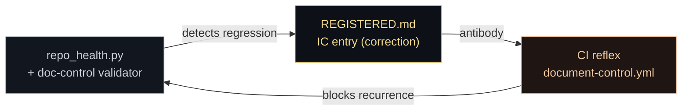

<p align="center">
  
</p>

<h1 align="center">SYSTEM HEALTH — Vitals & Diagnosis</h1>
<p align="center"><em>Is the organism well? Capabilities, live vitals, and how to run a checkup.</em></p>
<p align="center"><sub>Companion to <a href="START_HERE.md">START_HERE.md</a> · wired to the immune memory (<a href="REGISTERED.md">REGISTERED.md</a>)</sub></p>

---

## What this is

The system is designed as a living organism (see [START_HERE.md](START_HERE.md)). This file is its **vitals monitor** — a diagnosis surface for keeping the repositories functioning smoothly and in harmony with the framework's intention. It answers one question at a glance: **is each repo healthy, and if not, where's the lesion?**

It is deliberately built from the **basic level up**: a repo should be able to check its own vitals with no network and no dependencies — the way an immune system runs constant, local surveillance — before reaching for heavier external instruments. Recursive learning comes from application experience: each regression we catch becomes an entry in the [immune memory](REGISTERED.md), so the same failure is recognized faster next time.

## How health is measured — five body systems

`tools/repo_health.py` scores any repo 0–100 across five systems (offline, deterministic, stdlib-only):

| System | What it checks | Why it matters |
|---|---|---|
| 🧬 **Genome & orientation** | README · START_HERE · SEED | Can a newcomer (or future-you) find the front door and the *why*? |
| ⚖️ **Governance** | GOVERNANCE (Zones) · SESSION_RITUALS · CODEOWNERS | Is authority legible and are changes routed correctly? |
| 🛡️ **Immune memory** | REGISTERED.md + entry count · doc-control registry + validator | Does the repo remember its own lessons and enforce structure? |
| ⚡ **Reflexes (CI)** | workflows present · doc-control gate active | Do bad changes trip a reflex before they land? |
| 🫀 **Community & safety** | LICENSE · SECURITY · CONTRIBUTING · .gitignore | Is it safe and welcoming to build on? |

**Run a checkup** (from a repo root):

```bash
python3 tools/repo_health.py            # human-readable report
python3 tools/repo_health.py --markdown # table for this file
python3 tools/repo_health.py --strict   # exit 1 if vitality < 60 (use as a CI gate)
```

## 📊 Live vitals — the system, right now

_Snapshot: 2026-07-06. Regenerate the per-repo rows with `repo_health.py --markdown`; the cross-repo signals below come from the GitHub API (branch protection, CI, community profile)._

| Repo | Role | Branch protection | Doc-control gate | Community health | Verdict |
|---|---|---|---|---|---|
| **operations** | 🦴 exoskeleton / SSOT | ✅ light-touch (force-push + deletion blocked) | ✅ **active** | 🟠 **42%** — no SECURITY/CONTRIBUTING/COC | 🟡 well-run, thin community files |
| **humanaios** | 🫀 Body | ✅ require 1 review | ⬜ plan only | 🟢 85% | 🟡 2 Dependabot updates failing |
| **lasting-light-ai** | 🧠 Mind | ✅ require 1 review | ⬜ n/a (site) | 🟢 **100%** | 🟢 deploying green to humanaios.ai |
| **humanaios-internal** | 🔒 operator workspace | ✅ require 1 review | ⬜ n/a | 🔴 **28%** — no LICENSE | 🟡 low; private, lower stakes |

_Not shown — the two inert forks (`empirica`, `github-mcp-server`) are archive/sync candidates, not activation targets._

## 🩺 Current diagnosis (open items)

Ranked, honest, from the 2026-07-06 system audit:

- 🟠 **operations community-health = 42%.** The *source-of-truth* repo lacks `SECURITY.md`, `CONTRIBUTING.md`, and a code of conduct. Highest-leverage, lowest-risk fix. `JaaasperLiu/repo-doctor` can auto-generate compliant drafts.
- 🟡 **humanaios — 2 Dependabot update runs failing** (`@babel/core`, `form-data`). Dependency hygiene.
- 🟡 **humanaios-internal — no LICENSE**, and a placeholder token committed in `funding/humanaios-funding-pipeline/config.py` (move to an env var; add `gitleaks` to catch the pattern before a real one lands).
- 🟢 **Now healthy:** branch protection on all four live repos; the doc-control reflex is active on operations.

## 🧬 Wiring to the immune system

The health layer is not separate from the [immune memory](REGISTERED.md) — it feeds it:



When a checkup (or a human) catches a structural failure, register it as an **IC** (integrity correction) in [REGISTERED.md](REGISTERED.md). That entry is the antibody: it names the failure so `validate.py` / CI can be taught to block its recurrence. This is the recursive loop — *application experience → immune memory → reflex*.

## 🌱 The growth path — tools for promoting health

Adopt in order; each tier earns the next. We already run tier 1 natively and have **forked `ossf/scorecard`** (tier 3) — it just needs wiring.

| Tier | Tools | Promotes |
|---|---|---|
| **1 · Basic (native, now)** | `tools/repo_health.py` · `.doc-control/validate.py` · branch protection | Self-surveillance, structural integrity |
| **2 · Deterministic scoring + CI hygiene** | [spbuilds/repohealth](https://github.com/spbuilds/repohealth) (0–100, offline) · [rhysd/actionlint](https://github.com/rhysd/actionlint) · [zizmor](https://github.com/woodruffw/zizmor) (Actions security) | Objective scores, healthy CI |
| **3 · Security posture** | [ossf/scorecard](https://github.com/ossf/scorecard) *(already forked)* + scorecard-action · gitleaks / trufflehog (secrets) · Renovate (deps) | Supply-chain & secret safety |
| **4 · Community & standards** | [repo-doctor](https://github.com/JaaasperLiu/repo-doctor) (auto-generate SECURITY/CONTRIBUTING/COC) · shields.io badges · community health files | Contributor experience, trust |

---

<p align="center"><sub>❤️‍🩹 A healthy repo is one that can see its own state. · Regenerate vitals with <code>tools/repo_health.py</code> · <a href="START_HERE.md">START_HERE</a> · <a href="REGISTERED.md">Immune memory</a></sub></p>
