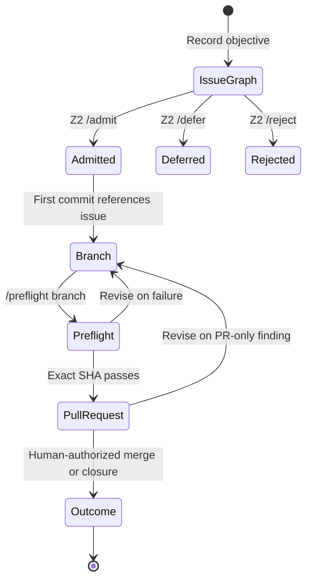

# Issue-First Session Admission

## Human summary

Substantive work now starts with one repository issue, not one pull request per
chat or agent session. The issue is the durable **session graph**: it holds the
objective, authority, evidence, boundaries, decisions, implementation links,
validation receipts, and observed outcome.

An issue is not technically a Git commit. In this process it is the **first
durable repository write**. Code commits follow only after the issue is
admitted. If a later session continues the same objective, it resumes the same
issue instead of creating another issue or PR.

## Lifecycle



Admission places an objective in the working set. It does not ratify a claim,
approve code, authorize deployment, or permit merge.

## Operator path

1. Open **Session graph / work admission** from the issue templates.
2. Use one objective and complete every required section.
3. Review the issue for authority, dependencies, resources, evidence, safety,
   reversibility, duplicate objectives, acceptance criteria, and falsifiers.
4. An actor named in `REPOSITORY_COORDINATOR_POLICY.json` records one exact
   command in an issue comment:
   - `/admit`
   - `/defer`
   - `/reject`
5. For admitted work, create a branch whose name contains the issue edge:
   `codex/issue-598-short-description`.
6. The first implementation commit contains this footer:

   ```text
   Refs: #598
   ```

7. Push the branch, then comment on the issue:

   ```text
   /preflight codex/issue-598-short-description
   ```

8. The trusted default-branch workflow resolves the branch to an exact SHA,
   checks issue/admission/first-commit binding, and runs safe code validation
   against that SHA without write credentials or repository secrets.
9. Open a PR only after applicable preflight checks pass. Its body contains one
   closing edge:

   ```text
   Closes #598
   ```

10. PR-context CI reruns. Human review decides whether to merge, revise, defer,
    or close. The issue receives the observed outcome and deviations.

## What can be checked before a PR

| Stage | Evidence available | Evidence unavailable |
|---|---|---|
| Issue | objective, scope, authority claim, readiness, falsifiers, admission provenance | code behavior, merge delta, review state |
| Branch preflight | exact SHA, issue binding, first-commit edge, changed files, tests, lint, manifest/document integrity, secret and dependency scans | PR mergeability, review decisions, final base/head diff semantics |
| Pull request | all branch evidence plus merge base, changed-file routing, duplicate active implementations, review state, required checks | human merge decision until explicitly made |

Therefore “all CI before PR” means **all safe, applicable checks that do not
depend on a PR object**. Checks whose inputs are the PR itself must run after
the PR exists. Preflight never suppresses that final pass.

## Trust boundary

- The admission policy, command allowlist, issue validator, and preflight
  workflow are read from the default branch.
- Issue body text, assignment, labels, and unauthorized comments cannot grant
  admission.
- The latest exact authorized command controls dynamic admission. Explanatory
  text may follow the command on later lines.
- Candidate code runs only in a read-only, secret-free job after metadata
  binding passes.
- The preflight receipt names the exact head SHA. A later commit invalidates
  that receipt and needs another run.
- The PR admission gate independently rebuilds admission evidence from the
  issue and default-branch policy.

## Session graph model

The graph does not require a graph database. GitHub supplies durable nodes and
edges:

| Node or edge | Representation |
|---|---|
| Objective node | Session-graph issue |
| Authority decision | Authorized `/admit`, `/defer`, or `/reject` comment |
| Implementation edge | Branch name plus first-commit `Refs: #N` footer |
| Validation evidence | Preflight receipt bound to a commit SHA |
| Review edge | PR body `Closes #N` |
| Outcome | Merge/closure plus issue outcome update |
| Revision history | Issue edits, decision comments, commits, and workflow runs |

One issue may accumulate multiple implementation attempts, preflight receipts,
or sessions while the objective remains the same. A new issue is warranted
only when the objective, authority boundary, or falsifier set materially
changes.

## Exceptions

- Dependabot and other policy-named maintenance actors remain in the
  maintenance lane.
- Existing PRs created before this policy may receive a documented,
  default-branch grandfathering entry.
- Pure coordinator control-plane repairs retain their narrow recursive-
  admission exemption, but still require ordinary Z2 review.
- Emergency execution does not gain merge or deployment authority from this
  process; applicable Z3 controls remain intact.

## Failure interpretation

| Result | Meaning | Next action |
|---|---|---|
| Session structure fails | Required reasoning/evidence is missing | Complete the issue; do not implement |
| Admission review | Structure is valid but Z2 has not admitted it | Admit, defer, or reject |
| Metadata preflight fails | Issue, branch, commit, or authority edges do not agree | Repair the binding; do not run candidate code |
| Code preflight fails | Exact candidate SHA has a technical finding | Revise on the branch and rerun |
| PR-only check fails | Merge-context evidence changed or was unavailable earlier | Resolve in the PR; preflight does not override it |

`SESSION_ISSUE_PRECEDES_IMPLEMENTATION · ISSUE_CREATION_IS_NOT_ADMISSION ·
PREFLIGHT_IS_NOT_PR_VALIDATION · ADMISSION_IS_NOT_MERGE_AUTHORITY`
