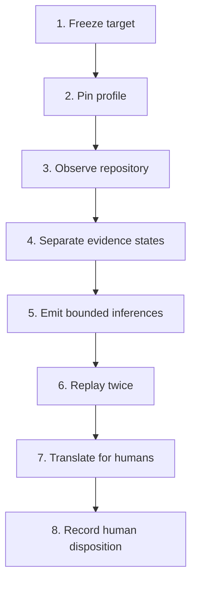

# Repository Evidence Graph Method v0.1

## Outcome

The Repository Evidence Graph Method turns a frozen Git repository into a deterministic, provenance-bearing read model, a bounded inference queue, and a human review packet. It is repository-agnostic: repository-specific meaning lives in a hash-pinned profile, while the compiler, validation rules, and human-review contract remain stable.

The method does **not** certify a repository, infer that a declared control operates, authorize a change, or replace human review.

## Method



### 1. Freeze target

Pin the target repository to an exact commit and require a clean worktree by default. A dirty-tree method run requires an explicit override and remains visibly marked `DIRTY`.

### 2. Pin profile

The profile declares:

- repository identity and graph identity;
- content and path exclusions;
- canonical artifacts and their declared roles;
- any explicit semantic mappings;
- allowed deterministic inference rules;
- prohibited conclusions;
- bounded review views.

A profile inside the target repository is part of the scanned tree. A cross-repository profile is permitted only with `--allow-external-profile`; its content is SHA-256 pinned, labeled `EXTERNAL_METHOD_INPUT`, and never silently copied into the target.

### 3. Observe repository

The compiler inventories Git-visible artifacts and extracts only bounded mechanical relationships, including:

- directory containment and content hashes;
- Markdown headings and exact path references;
- Python definitions and imports;
- JavaScript/TypeScript static imports;
- test-to-local-module relationships;
- GitHub Actions workflows, jobs, dependencies, actions, and invoked paths;
- JSON Schema declarations and references;
- configured structured source graphs.

Static extraction describes source structure. It does not prove runtime reachability, deployment, execution, or effectiveness.

### 4. Separate evidence states

Every relationship remains one of `CLAIMED`, `SPECIFIED`, `IMPLEMENTED`, `TESTED`, or `OBSERVED`. `MODEL_INFERRED` is reserved for assertion nodes and is never emitted as a fact edge.

### 5. Emit bounded inferences

Inference is profile-declared, deterministic, one-pass, non-recursive, premise-bearing, falsifiable, and `UNREVIEWED`. Each assertion records its rule hash, premise hash, source events, assumptions, confidence scope, independence state, falsifier, and human-review requirement.

The compiler rejects conclusions that claim authority, authorization, capability, eligibility, enforcement, execution, causality, proof, or test success.

### 6. Replay twice

The `method` command builds the graph twice in memory. The canonical graph objects and source-tree digests must match before any method receipt is emitted.

### 7. Translate for humans

The method emits `human-review.md`. It reduces the reviewer task to four bounded questions:

1. Is this the intended repository snapshot?
2. Are the curated profile mappings fair and correctly scoped?
3. Are the recorded gaps acceptable for this use?
4. Do material inferred assertions survive inspection of their premises and falsifiers?

Humans are not expected to inspect every graph node. Machine validation checks structural integrity; humans review meaning, omissions, material inferences, and the requested disposition.

### 8. Record human disposition

The generated packet offers four non-authorizing dispositions:

- `ACCEPT READ MODEL`
- `REVISE PROFILE`
- `REQUEST EVIDENCE`
- `REJECT RUN`

Merge, deployment, ratification, and execution remain separate human-authorized acts.

## Run the method

For a profile stored in the target repository:

```bash
python3 tools/repository_knowledge_graph_v0_1.py method \
  --repo /path/to/repository \
  --profile architecture/repository-knowledge-graph/profile.json \
  --output /tmp/repository-graph
```

For a profile maintained outside the target repository:

```bash
python3 tools/repository_knowledge_graph_v0_1.py method \
  --repo /path/to/repository \
  --profile /path/to/pinned-profile.json \
  --allow-external-profile \
  --output /tmp/repository-graph
```

## Outputs

| Output | Purpose |
|---|---|
| `human-review.md` | Primary human decision aid |
| `method-receipt.json` | Target, profile, digests, validation, and two-build replay result |
| `summary.md` | Technical overview |
| `graph.json` / `graph.json.gz` | Canonical machine read model |
| `graph.graphml` | Graph interchange |
| `nodes.csv` / `edges.csv` | Tabular inspection |
| `inferences.csv` / `inferences.jsonl` | Complete inference review queue |
| `views/*.json` | Bounded projections |
| `manifest.json` | Hashes for every generated artifact |

## Failure conditions

The method fails closed when:

- the target is not a Git repository;
- a profile is missing, malformed, excluded from an in-repository scan, or external without explicit opt-in;
- a configured source graph is missing or malformed;
- inference is recursive, premise-free, or uses a forbidden conclusion;
- graph validation detects duplicate identities, dangling edges, missing provenance, invalid views, or integrity mismatch;
- the two deterministic builds differ;
- the target worktree is dirty without explicit permission.

Warnings remain visible when external GitHub state is not hydrated, path-like references cannot be resolved, or source files cannot be parsed. Warnings are not silently converted into passes.

## Replication test

The first cross-repository profile is `architecture/repository-knowledge-graph/profiles/lasting-light-ai.json`. It treats `humanaios-ui/lasting-light-ai` as a frozen external corpus, preserves its research claims and specifications without promotion, and exercises the method against a TypeScript/JavaScript-centered repository.
