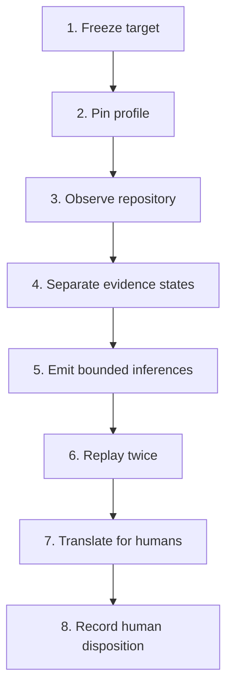

# Repository Knowledge Graph v0.1

## Outcome

The repository knowledge graph is a deterministic, read-only compiler over a
Git repository. The operations profile joins source topology and this
repository's existing named graphs without converting the result into a new
authority surface. Other repositories can supply their own hash-pinned profile.

The graph answers five different questions without collapsing them:

1. What artifacts, symbols, schemas, tests, workflows, and references exist?
2. What does each existing Intent, Evidence, System, Capability, CRB, and
   Morphogenesis graph declare?
3. Which relationships were mechanically observed, and which remain claimed or
   specified?
4. Which bounded view should a human or tool inspect for the current question?
5. Which additional relationships follow from explicit deterministic rules, and
   what premises and falsifier produced each inference?

The compiler does not answer whether HumanAIOS is safe, complete, compliant, or
ready to act. Those are governed judgments that require evidence, warrant, and
the appropriate authority.

## Why this is a multiplex graph

HumanAIOS already has multiple graph families:

- INTENT_GRAPH.yaml
- EVIDENCE_GRAPH.json
- system_graph.json
- crb/capability_graph.json
- crb/morphogenesis.json
- crb/workflows.json
- GRAPH_ALIGNMENT.yaml
- ARTIFACT_INVENTORY.jsonl

Those graphs do not use identical ontologies or authority states. v0.1 imports
them under separate namespaces and preserves their source status. Similar labels
are not automatically treated as the same referent. Cross-graph identity exists
only when an explicit alignment or profile mapping says it exists.

This is deliberate:

> one repository can support many projections without creating many truths.

## Core distinction

The compiler carries five edge states already used by the repository:

| State | Meaning in this graph |
|---|---|
| CLAIMED | A source declares the relation; the compiler did not verify it. |
| SPECIFIED | A contract, model, or explicit mapping specifies the relation. |
| IMPLEMENTED | An implementation relationship is explicitly represented. |
| TESTED | A test relationship is explicitly represented. |
| OBSERVED | The compiler mechanically observed the source/provenance relation. |

OBSERVED does not mean the underlying claim is true. For example, the compiler
may observe that system_graph.json declares a component OPERATED. The declaration
is observed; the operational status remains a claim unless execution evidence
supports it.

Inference uses a separate epistemic state:

| State | Meaning in this graph |
|---|---|
| MODEL_INFERRED | A deterministic rule emitted a reviewable assertion from explicit premise edges. It is not an observation, warrant, authorization, or fact. |

## Invariants

- Graph is not authority.
- Reference is not evidence.
- Claim is not implementation.
- Implementation is not test.
- Test is not observed outcome.
- Test association is not test pass.
- Inference is not observation.
- Inference is not warrant.
- Inference is not authorization.
- Inference must be reconstructable and falsifiable.
- Model agreement is not proof.
- Participation is not authority.
- Calibration is not warrant.
- Warrant is not authorization.
- Authorization is not execution.
- No graph import or generated edge grants authority.
- No graph delta is applied by this compiler.
- No label similarity is used as independent convergence evidence.

Every node and edge carries provenance. Every generated edge has
authority_effect = NONE.

## Layers

### Source layer

Mechanically inventories:

- Git-tracked and non-ignored working-tree artifacts;
- directories and containment;
- Python symbols and imports;
- test-to-local-module imports;
- GitHub Actions workflows, jobs, dependencies, actions, and invoked paths;
- JSON Schemas and schema references;
- Markdown level-one and level-two sections;
- exact or uniquely resolved repository file references;
- HumanAIOS work-item identifiers;
- GitHub shorthand references.

Content is not copied into the graph. Files matching configured privacy or
binary exclusions remain inventory nodes, but their contents are not scanned.

### Declared layer

Imports existing graph artifacts into namespaced nodes. The namespace prevents
an Intent node, Evidence node, and System node with similar language from
silently becoming one object.

### Semantic layer

The reviewable graph profile contains only explicit cross-cutting mappings
needed for the shared HumanAIOS control and accountability views:

~~~text
Intent
→ Capability
→ Evidence
→ Warrant
→ Authorization
→ Action
→ Consequence
→ Observation
→ Correction
~~~

The critical edge is:

~~~text
Warrant --INFORMS_BUT_DOES_NOT_GRANT--> Authorization
~~~

### External layer

References to work items, GitHub items, external Python modules, actions, and
schemas are retained as references. Bare #123 syntax remains
ISSUE_OR_PULL_REQUEST with state UNKNOWN until an external snapshot adapter
supplies live metadata.

### Finding layer

Parse failures and unresolved repository-like paths are represented as findings,
not silently discarded.

### Inferred layer

Inference is deterministic, bounded, one-pass, and non-recursive. The compiler
never inserts an inferred predicate directly between two repository objects.
Instead it creates an `inference_assertion` node containing:

- the rule ID, rule hash, and description;
- subject, predicate, and optional object;
- every premise edge ID, premise-set hash, and source event;
- confidence scoped to the structural rule application—not truth;
- independence state;
- assumptions and explicit `not_evidence_of` limits;
- a falsifier;
- `UNREVIEWED` human-review state;
- `authority_effect = NONE`.

The assertion is connected to its subject, object, and intermediate or evidence
sources with `INFERENCE_*` scaffold edges. Those scaffold edges are navigational
only. Inferred assertions cannot become premises for another inference pass.

The initial rule set is intentionally narrow:

| Rule | Permitted conclusion | What it does not establish |
|---|---|---|
| RKG-INF-LOCAL-DEPENDENCY-01 | MAY_DEPEND_ON_TRANSITIVELY | Runtime execution, causality, capability, authority |
| RKG-INF-WORKFLOW-TEST-PATH-01 | MAY_EXERCISE | Workflow success, test pass, claim proof, runtime coverage |
| RKG-INF-DECLARED-SYSTEM-TEST-01 | HAS_TEST_ARTIFACT_CANDIDATE | Implementation truth, test execution, operational effectiveness |
| RKG-INF-CONVERGENCE-CANDIDATE-01 | HAS_CONVERGENCE_CANDIDATE | Independence, corroboration, proof, consensus |
| RKG-INF-EVIDENCE-CONFLICT-01 | HAS_UNRESOLVED_EVIDENCE_CONFLICT | Which side is correct or whether the claim is defeated |
| RKG-INF-CONTESTED-DEPENDENCY-01 | HAS_CONTESTED_EVIDENCE_DEPENDENCY | Claim defeat, warrant invalidity, correctness, authorization withdrawal |

The compiler rejects any configured inference whose conclusion would claim
authorization, authority, enforcement, eligibility, capability, causality,
execution, proof, or test success.

## Views

| View | Primary use |
|---|---|
| Repository | Code, documents, tests, schemas, workflows, and dependencies |
| Knowledge | Vision, mission, principles, objectives, and citations |
| Evidence | Claims, controls, evidence, tests, failures, falsifiers, decisions |
| Inference | MODEL_INFERRED assertions, premises, confidence, falsifiers, review state |
| Governance | Roles, gates, proposals, ratification, execution, receipts |
| Accountability | Who may propose, ratify, execute, and observe |
| Control | Intent-to-consequence feedback loop |
| Evolution | Capability, CRB, morphogenesis, graph-delta lifecycle |
| Convergence | Explicit alignment, dependence, divergence, coverage gaps |
| Risk | Failures, falsifiers, unresolved references, unknown external state |
| Provenance | Citations, derivations, declarations, repository references |

Views are filters over the shared graph. They do not maintain separate copies of
truth.

## Build

From the repository root:

~~~bash
python3 tools/repository_knowledge_graph_v0_1.py build
~~~

Generated files are written to outputs/repository-knowledge-graph, which is
ignored by Git because the graph is a reproducible read model rather than a
hand-maintained source:

- graph.json
- graph.json.gz
- graph.graphml
- nodes.csv
- edges.csv
- inferences.jsonl
- inferences.csv
- human-review.md
- summary.md
- views/*.json
- manifest.json

The source-tree digest identifies the exact scanned content, including
non-ignored working-tree changes. The graph digest covers the canonical graph
object. Rebuilding the same tree with the same profile yields the same digest.
Large views are emitted as reference sets of node and edge identifiers; bounded
views are self-contained. Both resolve against graph.json.

## Validate

~~~bash
python3 tools/repository_knowledge_graph_v0_1.py validate \
  --graph outputs/repository-knowledge-graph/graph.json
~~~

Validation rejects:

- duplicate node or edge identifiers;
- dangling edges;
- unrecognized evidence states;
- missing provenance;
- authority-granting generated edges;
- recursive or premise-free inference assertions;
- inferred premises used for further inference;
- forbidden inference predicates such as AUTHORIZES, PROVES, or TESTS_PASS;
- missing inference subject/object scaffold links;
- invalid view members;
- integrity mismatch.

Warnings preserve incomplete external metadata, unresolved path references, and
parse failures as explicit coverage gaps.

## Replicate the full method

The `method` command runs the completed process as a reusable method: it
requires a clean target by default, compiles the same snapshot twice, compares
the canonical results, validates the graph, and emits both `human-review.md`
and `method-receipt.json`.

~~~bash
python3 tools/repository_knowledge_graph_v0_1.py method \
  --repo /path/to/target-repository \
  --profile /path/to/profile.json \
  --allow-external-profile \
  --output /tmp/repository-graph
~~~

External profiles are opt-in, content-hashed inputs. They do not mutate the
target repository and their absolute filesystem location is not written into
the graph. The complete reusable method, human review contract, and first
cross-repository replication receipt appear below.

## Query

Search:

~~~bash
python3 tools/repository_knowledge_graph_v0_1.py query \
  --graph outputs/repository-knowledge-graph/graph.json \
  --search warrant
~~~

Inspect one exact node:

~~~bash
python3 tools/repository_knowledge_graph_v0_1.py query \
  --graph outputs/repository-knowledge-graph/graph.json \
  --node concept:authorization
~~~

Extract a bounded view:

~~~bash
python3 tools/repository_knowledge_graph_v0_1.py query \
  --graph outputs/repository-knowledge-graph/graph.json \
  --view evolution
~~~

Inspect assertions emitted by one inference rule:

~~~bash
python3 tools/repository_knowledge_graph_v0_1.py query \
  --graph outputs/repository-knowledge-graph/graph.json \
  --rule RKG-INF-WORKFLOW-TEST-PATH-01
~~~

## Governance boundary

This implementation is a Z1 diagnostic/read-model artifact. Adding it does not:

- ratify the profile;
- resolve an existing contradiction;
- promote an open issue;
- change the Repository Coordinator queue;
- add a CI gate;
- modify a canonical source graph;
- authorize a graph delta;
- deploy a service;
- act on credentials or external systems.

Changing the graph profile can change the semantic projection and therefore
requires review. Changing repository sources changes the generated graph
mechanically. Any future move from diagnostic read model to an enforcing gate
would be a separate governed change.

## Known v0.1 limits

1. GitHub shorthand is not hydrated with live issue/PR metadata.
2. Python and JavaScript/TypeScript analysis is syntactic and module-level;
   there is no call graph or proof of runtime reachability.
3. Test imports show a test relationship, not a passing test result.
4. Markdown reference extraction can preserve unresolved examples as findings.
5. No natural-language claim extraction is attempted.
6. No semantic identity is inferred from embedding or label similarity.
7. Runtime outcomes, deployment state, and external telemetry require explicit
   adapters and receipts.
8. Inference is structural only; it does not use embeddings, language-model
   judgments, natural-language entailment, or hidden similarity thresholds.

These are intentional limits. v0.1 adds a reconstructable inference substrate
without allowing inferred assertions to become authority, proof, or recursive
premises.

## Human review translation

This file is the human-review entry point in the PR. The generated
`human-review.md` is the primary decision aid for a specific run because its
counts, warnings, hashes, and sampled assertions are derived from the exact
graph under review.

A human does not need to read thousands of nodes or edges. Review is divided by
comparative advantage:

| Machine review | Human review |
|---|---|
| Deterministic inventory | Whether the selected snapshot is the intended one |
| Hash and manifest integrity | Whether the profile's curated meanings are fair |
| Duplicate and dangling-edge checks | Whether important context or evidence is omitted |
| Rule and premise reconstruction | Whether a material inference survives its falsifier |
| Forbidden-conclusion enforcement | Whether the read model is useful for the stated purpose |
| Two-build replay | Final disposition and rationale |

### Translation key

| Graph language | Human reading |
|---|---|
| `OBSERVED` | The compiler mechanically saw this relationship in source. It does not prove the underlying claim. |
| `SPECIFIED` | A document, contract, graph, or curated profile says this relationship should exist. |
| `CLAIMED` | A source asserts this; verification remains open. |
| `TESTED` | A test relationship is represented; it does not mean the test ran or passed. |
| `MODEL_INFERRED` | A bounded rule produced a review candidate from explicit premises. |
| Confidence | Strength of the structural rule application, not probability of truth. |
| Independence `NOT_ESTABLISHED` | Distinct sources may still share origin, method, or failure mode. |
| Falsifier | The observation that would defeat the candidate interpretation. |
| `authority_effect: NONE` | The graph cannot authorize, ratify, merge, deploy, or execute. |

### Review order

1. Open `human-review.md`.
2. Confirm repository, commit, worktree state, profile hash, source-tree hash,
   and graph hash.
3. Review the profile's canonical artifacts, semantic mappings, exclusions,
   rules, and views.
4. Read every coverage warning. Missing data must remain visible.
5. Trace material samples through `inferences.csv` to their premise edge IDs
   and falsifiers.
6. Use `graph.json` when the bounded files do not answer the review question.
7. Record one disposition and rationale outside the generated artifact.

The generated packet offers four non-authorizing dispositions:

- `ACCEPT READ MODEL`
- `REVISE PROFILE`
- `REQUEST EVIDENCE`
- `REJECT RUN`

`ACCEPT READ MODEL` means only that, for the pinned snapshot and profile, the
graph is a sufficiently faithful and bounded diagnostic representation for the
stated review purpose. It does not mean the repository is safe, complete,
effective, or production-ready; that claims are proven; that tests passed; that
a declared control operated; that a profile is ratified; or that a PR should be
merged. Those decisions require their own evidence and human authority.

## Repository Evidence Graph Method v0.1

The general method turns a frozen Git repository into a deterministic,
provenance-bearing read model, bounded inference queue, and human review
packet. Repository-specific meaning lives in a hash-pinned profile while the
compiler, validation rules, and review contract remain stable.

### 1. Freeze target

Pin the target to an exact commit and require a clean worktree by default. A
dirty-tree run requires an explicit override and remains visibly marked
`DIRTY`.

### 2. Pin profile

The profile declares repository and graph identity, exclusions, canonical
artifacts, explicit semantic mappings, permitted rules, prohibited conclusions,
and bounded views. An external profile requires `--allow-external-profile`; its
content is SHA-256 pinned and labeled `EXTERNAL_METHOD_INPUT` without being
copied into the target.

### 3. Observe repository

Inventory Git-visible artifacts and extract bounded mechanical relationships:
content hashes, containment, headings, exact path references, Python and
JavaScript/TypeScript imports, test relationships, workflows, schemas, and
configured structured graphs. Static extraction does not establish runtime
reachability, deployment, execution, or effectiveness.

### 4. Separate evidence states

Keep every source relationship in `CLAIMED`, `SPECIFIED`, `IMPLEMENTED`,
`TESTED`, or `OBSERVED`. Reserve `MODEL_INFERRED` for assertion nodes rather
than fact edges.

### 5. Emit bounded inferences

Inference is profile-declared, deterministic, one-pass, non-recursive,
premise-bearing, falsifiable, and `UNREVIEWED`. Each assertion records rule and
premise hashes, source events, assumptions, confidence scope, independence
state, falsifier, and review requirement. Forbidden conclusions include
authority, authorization, capability, eligibility, enforcement, execution,
causality, proof, and test success.

### 6. Replay twice

Build twice in memory. Canonical graph objects and source-tree digests must
match before the method emits a receipt.

### 7. Translate for humans

Emit `human-review.md` with four bounded questions: is this the intended
snapshot, is the profile fair, are the gaps acceptable, and do material
assertions survive inspection of their premises and falsifiers?

### 8. Record human disposition

A person records one non-authorizing disposition. Merge, deployment,
ratification, and execution remain separate governed acts.

### Method outputs

| Output | Purpose |
|---|---|
| `human-review.md` | Primary human decision aid |
| `method-receipt.json` | Target, profile, digests, validation, and replay result |
| `summary.md` | Technical overview |
| `graph.json` / `graph.json.gz` | Canonical machine read model |
| `graph.graphml` | Graph interchange |
| `nodes.csv` / `edges.csv` | Tabular inspection |
| `inferences.csv` / `inferences.jsonl` | Complete inference review queue |
| `views/*.json` | Bounded projections |
| `manifest.json` | Hashes for every generated artifact |

The method fails closed for a non-Git target, invalid or unapproved external
profile, missing configured source, forbidden or recursive inference, invalid
graph structure, divergent replay, or dirty target without explicit permission.
Missing external metadata, unresolved path-like references, and parse failures
remain visible warnings rather than silent passes.

## Lasting Light AI replication pilot

The method reproduced successfully against `humanaios-ui/lasting-light-ai`
without modifying the target repository. This is method replication, not
certification of Lasting Light AI or proof that its research, governance,
tests, or workflows operate as described.

### Reproducibility receipt

| Field | Result |
|---|---|
| Method | `REPOSITORY_EVIDENCE_GRAPH_METHOD` v0.1.0 |
| Target | `humanaios-ui/lasting-light-ai` |
| Target commit | `f2cb8a60419f04d12d6f7f5ab97b272d65f41402` |
| Worktree | `CLEAN` |
| Profile scope | `EXTERNAL_METHOD_INPUT` |
| Profile SHA-256 | `864fd1441ac073aed950375d9fe36ca203e851d59382b2b1656479bedaa2353e` |
| Source-tree SHA-256 | `8b5f9eec74fe8b477c0958798efd04fc90f1241323511d26bffeeedaa373c245` |
| Graph SHA-256 | `593983e59926befbcf1f8d83d0d11c62ab17021b79c9b6a30a2748fe073edbee` |
| Structural validation | PASS |
| Two-build canonical match | PASS |
| Two-build source-tree match | PASS |
| Target mutations | None |

The replay emits the complete machine-readable receipt as
`method-receipt.json`; the essential result is preserved here for PR review.

### Graph snapshot

| Measure | Count |
|---|---:|
| Nodes | 1,015 |
| Edges | 1,752 |
| Views | 5 |
| Static local imports | 95 |
| Test-to-implementation relationships | 3 |
| Bounded inference assertions | 28 |
| Output files | 16 |

All 28 assertions came from `RGM-INF-LOCAL-DEPENDENCY-01`. They identify
possible two-hop static dependency paths, including `src/App.tsx` to
`src/lib/contamination.ts` and `src/pages/Experiment.tsx` to
`src/lib/storage.ts`. These candidates do not establish runtime execution,
causal influence, capability, deployment, or authority.

### Material findings

1. `.github/workflows/framework-audit.yml` contains a YAML document start at
   line 1 and a second document separator after its opening comments. A
   single-document workflow parser reports a second document at line 5. This
   is source evidence about the file shape, not proof that it caused a
   particular GitHub Actions result.
2. Thirty-one path-like references do not resolve to current artifacts,
   including `data/validation_phase1.csv`, `src/lib/EpistemicDJ.ts`,
   `src/components/BehavioralNavigator.ts`, and
   `src/acat2c/scoring/aggregation.py`. These require human classification as
   examples, planned paths, archived components, or stale references.
3. Nineteen labeled issue or PR references were extracted without live-state
   hydration. They remain references rather than evidence about current state.
4. The source graph contains three static `TESTS` relationships, but the
   workflow rule emitted no `MAY_EXERCISE` assertions. The parser follows
   explicit paths in `run:` steps and does not expand npm package scripts into
   test files. This is a visible method limit rather than a failed test.

The bounded Z1 recommendation is `ACCEPT READ MODEL` for diagnostic use,
`REQUEST EVIDENCE` for the workflow parse finding and material unresolved
paths, and no promotion of the 28 dependency assertions beyond
`MODEL_INFERRED` without premise review. Only a human reviewer may record the
disposition.

- [ ] ACCEPT READ MODEL
- [ ] REVISE PROFILE
- [ ] REQUEST EVIDENCE
- [ ] REJECT RUN

Reviewer rationale: ________________________________________________

Replay with:

~~~bash
python3 tools/repository_knowledge_graph_v0_1.py method \
  --repo /path/to/lasting-light-ai \
  --profile /path/to/operations/architecture/repository-knowledge-graph/profiles/lasting-light-ai.json \
  --allow-external-profile \
  --output /tmp/lasting-light-ai-graph
~~~

The pilot additionally verified every manifest hash, the gzip round trip,
GraphML parsing, CSV row counts, and JSONL inference count.